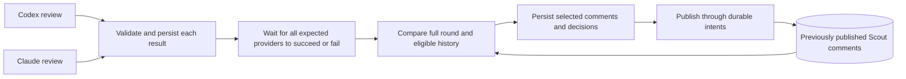

# Scout inline review deduplication design

Date: 30 September 2026

Status: Implemented locally; wait for all providers, then select and publish.
Live Bitbucket and provider CLI contracts still require release verification.

Code baseline: `19dee02` (includes durable review snapshots and report-comment retry tracking)

Run independent provider reviews concurrently on one snapshot. Wait until every expected provider has either returned a validated result or failed, then use a cheap model to select the most meaningful original comments before publishing. A finding that fully covers another finding wins; uncertain or partially overlapping findings both survive.

At the baseline, Scout supports running both providers in inline mode, but publication tracking includes the provider and review run, so it cannot recognize duplicates across providers or reruns. See `StateStore.inline_comment_published` in [state.py](../src/scout/state.py).



This barrier lets Scout compare every successful provider's findings before the first comment is posted. Provider completion order cannot decide which wording wins. Healthy queueing may take as long as needed. A provider that fails is logged and left out, and the round publishes the results of the providers that succeeded. The persisted transition to `ready_for_selection` ends the review phase: no review provider is retried or waited for, even while selection is waiting for capacity. The selector follows the same availability policy: if it cannot recover from an error or cooldown within its recovery window, Scout publishes every candidate without deduplication.

The coordination is simpler: one complete input set, one saved selection plan, and one publication stage per round. It removes first-arrival decisions, escalation replies, and carrying results between snapshots. Durable publication recovery and historical eligibility remain necessary because a process can still crash or a PR can become ineligible during publication. A newer source revision does not replace the reviewed snapshot.

1. **Select comments by issue coverage and usefulness.**

   Two findings are equivalent when they describe the same failing condition and affected behavior, and addressing one would address the other. For example, "the error path leaks the socket" and "close the socket before returning on failure" are equivalent even if they reference different lines.

   Coverage can also be directional. If A reports a socket leak on handshake timeout and B explains that the same missing cleanup leaks sockets on both timeout and authentication failure, B fully covers A and should be published. A broader title or longer explanation is not enough: B must retain A's concrete failing condition, consequence, and actionable fix, with enough evidence to support the additional scope. If B merely says "improve error handling," it cannot suppress A.

   For equivalent coverage, choose the original comment with the clearest supported explanation, most useful location, and most actionable fix. Use a stable candidate ID as the final tie-breaker, never completion order. Keep the selected comment's original text and suggestion; do not synthesize a merged comment. For a confirmed same-issue coverage group, its published severity is the highest severity reported by the covered candidates, with provenance recorded. This preserves the broader explanation without silently lowering the issue's priority. If their impact claims conflict or coverage is uncertain, retain both instead of combining them.

   Shared file, line, category, or similar wording is insufficient. Two independent bugs on the same line must both survive, as must partial overlap that neither comment fully covers. Do not suppress a chain A → B → C unless C directly and fully covers A as well as B. Every suppressed candidate must have direct coverage evidence against its final retained representative.

   Apply this within a provider's result, across all providers in the round, and against earlier eligible Scout comments on the PR. Human comments are out of scope. Historical comments are already published, so the policy for a new comment that adds scope or severity is separate (section 6).

2. **Run publication as its own stage, within review rounds.**

   **Scheduling.** Scout already runs jobs on a shared `ThreadPoolExecutor`, and `_schedule` in [daemon.py](../src/scout/daemon.py) already claims only jobs whose provider has capacity, skipping full providers. Workers are not owned by a provider, and `max_parallel` limits concurrent calls. This design changes three things:

   - **Non-blocking reservation.** `_run_job` currently calls `_acquire_provider_slot(..., blocking=True)`. Reserve provider capacity at dispatch without blocking, and release it when the call exits, including on errors and cancellation; a cancelled call that is still running keeps counting until it exits. A task never holds one provider's reservation while waiting for another. A stage that cannot get capacity saves its progress and returns to scheduling.
   - **Shared accounting.** Reviews, selection, risk assessment, and request evaluation all count against the same per-provider limit. Today `_schedule` counts only review futures.
   - **Fair dispatch.** When review work and selection/publication work are both runnable, alternate between the two classes: oldest review first, and oldest selection by readiness. Skip a class with nothing runnable. Publication-only work needs no provider slot. Waiting for the round barrier, a PR lock, backoff, or recovery never occupies a worker.

   **Job lifecycle and all-provider barrier.** Add a persisted `reviewed` status between review execution and round publication:

   - After validation, save the provider's complete result and release its slot and worker thread. An empty validated result counts as success; a failed, cancelled, timed-out, or quota-limited provider does not.
   - The round becomes ready for selection when every provider in its frozen expected set has reached a final outcome for the round's snapshot: a validated result, or failure. While any provider is still pending, retry it under the existing review retry and cooldown rules, keeping the results that already succeeded.
   - A provider **fails** when it exhausts its review attempts, hits a permanent (non-retryable) error, is disabled or removed from configuration during the round, or reaches its recovery deadline without a validated result. On the first retryable error, call timeout, or observed provider cooldown/quota block, persist `recovery_deadline_at = now + max_provider_recovery_seconds` (default 3600) for that round/provider. Until then the deadline is null: waiting for a shared worker or a provider concurrency slot never starts a failure clock. Keep the existing per-call timeout so a hung call eventually becomes an error. Cooldowns are too long to wait for while another provider can still review: an observed cooldown fails the provider immediately when another provider in the round has succeeded or is pending and not itself in cooldown. The check and the failure share one transaction, so the last provider able to review instead waits within its recovery deadline, and cooldown deferral does not count against the attempt limit.
   - Once set, the recovery deadline is a fixed UTC timestamp. Backoff, capacity waits after the error, and daemon downtime do not pause or extend it. This bounds recovery after an observed problem without accumulating separate kinds of wait time. A validated result must be committed before the deadline; otherwise mark the provider failed and fence its late result. The scheduler checks these deadlines even while the provider is in cooldown. Log the provider, round, reason, and last error. Successful providers and other PRs continue normally.
   - Commit the final provider outcome and the round's transition from `reviewing` to `ready_for_selection` in one SQLite transaction, provided at least one provider succeeded. Freeze the successful and failed provider sets at this point and persist `selection_ready_at`; the selection recovery deadline starts null. This transition ends the review phase, before any selection worker is claimed or model call begins. Cancel outstanding work for failed providers, and fence their late results so they can never enter the round, just as superseded results are fenced. Publication never retries a review provider or waits for one.
   - If at least one provider succeeded, select and publish from the successful results; the round records which providers were skipped. If every provider failed, the round ends `review_failed` and publishes nothing. An explicit request starts a new round. Other PRs continue.
   - A separate round-level publication step claims ready rounds with its own lease, attempt limit, and retry-after timestamp. It saves exactly one plan (model-selected or fallback), then publishes that plan. Delivery failures back off in this stage; exhaustion becomes `publication_failed`, keeping results and the plan. Capacity waits and cooldowns do not consume attempts.
   - If the PR lock is held or classifier capacity is unavailable, defer the round until a later scheduling pass. Never block a worker or renew a lease while waiting for providers or capacity.
   - After a restart or lease expiry, resume the publication stage after reconciling its intents. Do not rerun reviews or choose different representatives for an already saved plan. Existing lease fencing and worker-future exclusion apply to both stages.

   **Selection fallback.** Healthy queueing does not expire selection. On the first selector error (including invalid output or call timeout), or observed cooldown/quota block, persist `selection_recovery_deadline_at = now + max_selection_recovery_seconds` (default 600). Use the same fixed-timestamp rule as provider recovery: no pausing, accumulated wait counters, or reset on restart. Use the configured model-call timeout; once a recovery deadline exists, also bound calls by its remaining time. An unavailable selector cannot prevent successful reviews from being published indefinitely.

   When that deadline passes, the selector has a permanent error, or its retries are exhausted, save a **fallback plan** that retains every candidate, including exact duplicates. Record `selection_fallback` and its cause, then deliver the saved plan normally. This accepts possible semantic duplicates instead of discarding successful reviews. The fallback needs no model-provider slot, but must still reconcile unknown publication outcomes before posting.

   Saving a model-selected plan is one conditional transaction: the round must still be current and eligible, the selection lease must still be valid, no plan may already exist, and the recovery deadline must be null or strictly in the future. If a deadline has expired, only the fallback may be saved, even if the model response reaches SQLite before the fallback worker does. Model and fallback writers compete for the same single initial-plan record. Expiry checks run without acquiring selector capacity; late responses cannot change an already saved plan.

   **Disabled deduplication** produces the same retain-everything plan as the fallback, without calling the selector. Empty successful results also need no model call. These cases save a deterministic plan immediately. Once any plan is saved, delivery follows the publication retry rules. Keep queue wait, provider-capacity/cooldown wait, and model execution time separate in diagnostics, but use only the persisted recovery deadline to decide expiry.

   **Review rounds.** A round has a `round_id`, trigger identity, frozen expected provider set, policy/schema versions, and an immutable snapshot: source commit, destination branch and commit, and merge base, resolved before dispatch. Each provider result belongs to exactly one round, independently of its run ID. Reusing a `review_jobs` row must not overwrite earlier results or intents.

   Create a round and all its provider jobs in one SQLite transaction; for an explicit request, record the processed request comment ID and `updated_on` in the same transaction, so a crash cannot enqueue a partial or duplicate round. Each explicit request gets its own round, even on the same commit. A new explicit request supersedes any unfinished round and pre-round inline publication job for that PR, including jobs from providers or policies no longer configured. Keep published comments and unresolved round intents, and fence old workers in the same transaction that creates the requested round. Normal polls create the initial round for a newly eligible PR that has not been reviewed. After that, only explicit requests create new rounds. Source pushes and destination changes do not replace either an unfinished or a completed inline review.

   Round membership is frozen; a newly configured provider joins the next round, and a provider removed or disabled during the round counts as failed (above). If the PR or repository becomes ineligible (including conversion to draft, which uses the same `prune_ignored_pull_requests` path), cancel the unfinished round, record why, and post nothing further for it. A later eligible request creates a new round. A round with exhausted publication failures stays `publication_failed`, keeping its saved plan, until an operator runs `--retry-publication ROUND_ID` (section 5) or a new request creates a new round.

   **Finish the reviewed snapshot.** Every provider reviews the source commit and merge base frozen when the round was created. Polling, selection, publication, and retries retain that snapshot even if newer commits appear. A source push does not discard results, replace the round, restart a provider, suppress findings, or create a notice. A new explicit review request supersedes unfinished work and starts a fresh round; late results from the superseded round remain fenced.

   The Bitbucket adapter sends only path, line, and side, so original line numbers cannot safely anchor comments in a newer diff. Each finding intent stores both its inline payload and a PR-level variant that names the original commit and location, without an applyable suggestion, and carries the same marker. At send time, if the PR's source or destination commit differs from the round snapshot, Scout posts the PR-level variant; otherwise it posts inline. This matches the pre-round behaviour. The review still describes its original snapshot. Publication failures follow the ordinary retry and operator-recovery rules, with no automatic new review.

   **Lifecycle checks before posting.** Fetch the PR and reuse that result for up to `publication_snapshot_cache_seconds` (default 10) within a batch. Cancel further publication if the PR is closed, converted to draft, ignored by branch rules, or its repository is disabled. A new source or destination commit alone does not make the round ineligible and does not require fetching the mirror or recomputing the merge base. A poll that discovers ineligibility fences the round immediately, including during the metadata cache window.

   **Partial provider coverage is visible on the PR.** When some providers failed and at least one successful result contains findings, reserve one PR-level `coverage_notice` in the saved plan, unique per `(round_id, coverage_notice)`. For example: "Scout reviewed `abc1234` with Codex. Claude did not complete this review (provider unavailable). Findings reflect Codex's review only." Name the successful and failed providers, the reviewed source and base commits, and a short failure category; keep raw errors in logs. Send this notice before the round's inline comments through the normal intent protocol. When all findings are already reported, the covered-review comment carries this information instead, so silence cannot imply that every provider reviewed the code. For empty successful results, put the coverage information in the clean-review comment instead; do not also post a coverage notice. If every provider failed, retain the existing `review_failed` behavior with nothing posted.

   Clean-review and coverage notices describe an explicit reviewed snapshot and do not have inline anchors. They require a current, eligible round and normal lease/recovery checks, but source movement alone does not block them. They never claim to review the current head when it differs from the named snapshot.

   **PR lock.** The publication step runs under a per-PR lock:

   ```text
   reconcile outstanding intents -> verify barrier and PR eligibility -> refresh history -> select and persist plan -> publish saved plan -> record outcome
   ```

   Providers review concurrently, but only one round publication step runs per PR; otherwise competing publishers could create conflicting plans or send the same intent. Scout runs one daemon per state directory (`RuntimeLock`), so an in-process lock suffices. Keep SQLite transactions short and never hold one across model or Bitbucket calls.

3. **Use exact matching first, then a narrowly scoped model selector.**

   Exact matches hash the substantive finding fields and code location at the reviewed revision, never provider names or provider `external_id` values. Providers rarely produce identical wording, so exact matching mainly covers identical findings and reruns. Preserve every candidate's provenance and severity. Historical matches still require comment eligibility and sufficient published severity.

   The selector receives all round candidates (Scout-assigned stable ID, provider provenance, reviewed revision, path, side, line, summary, explanation, severity, proposed fix) and eligible historical findings with their comment IDs and actual published content and severity. It follows the review-request classifier pattern ([comment_request.py](../src/scout/comment_request.py), `RequestCommentsConfig` in [config.py](../src/scout/config.py)): strict JSON schema, configurable cheap model and effort, timeout, and validated output. Finding IDs are assigned before the model call in a stable provider/result order.

   ```json
   {
     "candidate_id": "candidate-17",
     "decision": "covered",
     "covered_by": "candidate-23",
     "relationship": "representative_subsumes_candidate",
     "reason": "Candidate 23 explains the same missing cleanup and covers both timeout and authentication failure."
   }
   ```

   Decisions are `retain`, `covered`, or `uncertain`; uncertain findings are retained. A `covered` decision names its final retained candidate or eligible historical comment and explicitly distinguishes `equivalent` from `representative_subsumes_candidate`. Both other decisions use null coverage fields. A retained candidate may also name a historical finding it fully supersedes, with direct coverage evidence, for the historical policy in section 6. The model chooses among original comments; it cannot invent comment text, edit threads, or decide publication state.

   Every candidate needs exactly one decision. Validate known IDs, legal relationships, direct retained targets, no self references, no cycles, and no links through discarded candidates. Historical targets must meet eligibility and severity requirements. For an invalid response, retry the selection stage; never silently drop candidates. Only validated coverage groups determine severity aggregation. Store reasons and the final representative mapping for audit.

   Coverage must survive rendering. Give the selector the substantive text that will actually be published, accounting for the existing comment-length limit. A detail removed by formatting or truncation cannot justify suppressing another finding. Persist that exact rendered payload, including the selected severity and marker, so publication retries cannot change what covers the suppressed candidates.

   **Input limits.** Send all candidates and eligible historical findings in one call, bounded by `max_input_findings` and `max_input_bytes` (serialized UTF-8 including instructions and schema, leaving room for the response). When it does not fit, pick a deterministic subset of whole findings, prioritizing round candidates and nearby historical findings; never truncate a finding. A confirmed direct coverage relation within the subset can suppress. Omitted candidates and unmatched candidates with incomplete comparison coverage are `uncertain` and retained. Never suppress a candidate because an omitted finding might cover it. This preserves findings but may leave duplicates or miss the best representative. Record coverage and omission reasons. Multi-batch merging is deferred.

   **Untrusted input.** Finding text can quote PR content controlled by the author. Treat it as data, not instructions. For `CRITICAL` findings and security-lens findings, accept `covered` only when the representative is on the same path; otherwise retain the candidate as `uncertain`. This is a conservative guard, not a complete defense against incorrect model decisions.

4. **Persist findings and publication decisions before posting.**

   | Record | Purpose |
   |---|---|
   | Review round | Trigger, snapshot, expected and final provider outcomes, barrier status, per-provider recovery deadlines, selection readiness and recovery deadline, plan kind (selected, fallback, or disabled) and fallback reason, round ID |
   | Validated review result | Round/provider/run identity and original findings, so publication resumes without rerunning the review |
   | Canonical finding | Published content and severity, provenance, revision, root comment ID, eligibility, confirmed successor if superseded |
   | Publication intent | Stable publication ID, kind (finding, clean review, covered review, coverage notice), selected payload, state, version, returned comment ID, author identity, operator resolution and cancellation reason |
   | Selection plan and candidate decision | Immutable plan version, retained IDs, direct coverage mapping, selected severity and provenance, reasons, comparison coverage |

   The canonical registry belongs to `(workspace, repository, PR)`; provider and run are provenance. Persist the complete selection plan and its intents in one transaction before any POST. Freeze selected payloads and representatives once saved; a restart or partial publication must not rerun selection and choose a different comment. A covered candidate is complete only once its representative is confirmed published. If the representative fails publication, its covered candidates remain unresolved; suppression cannot hide an unpublished issue.

   Recheck historical targets before finalizing suppression. If a saved historical target becomes ineligible, conservatively restore the affected candidates as retained original comments in an additive, versioned plan amendment; do not reshuffle published or reserved representatives. If eligibility fails after round completion, only a later requested review reevaluates it. Cancel or supersede the round when its lifecycle requires it, preserving ambiguous intents as described below.

   **Retention.** Keep these records while the PR is open; provider-log retention must not touch them. `prune_ignored_pull_requests` cancels unsent work but keeps canonical findings and publication history.

   Closed-PR pruning today is fed the filtered PR list, so open draft and ignored-branch PRs are pruned as if closed. In `poll_once`, capture `all_open_pr_ids` from a complete, successful open-PR listing before any filtering, pass only that to `prune_closed_pull_requests`, and keep a separate eligible list for queueing. Skip closure pruning after a failed or incomplete listing, and keep the existing exclusion for PR-ID-scoped polling. This fix is independent of the rest of the design and can ship first.

   For a genuinely closed PR, pruning runs after its workers stop and after one final reconciliation, which may adopt a confirmed comment but never resends. Remaining `sending` or `unknown` intents are then cancelled with reason `pr_closed` and pruned, since Scout posts nothing further on a closed PR. No other automatic lifecycle transition (ignoring, disabling, draft conversion, supersession) may cancel an unresolved intent. Explicit operator-confirmed absence may settle an obsolete intent under the versioned protocol in section 5.

5. **Make publication recoverable.**

   Today's loop in [daemon.py](../src/scout/daemon.py) posts before recording, so a crash in between duplicates the comment on retry.

   **Markers.** Each intent gets a stable publication ID rendered as a marker in the footer, outside the body that `_format_inline_comment_parts` truncates. `publish_inline_pull_request_comment` and `publish_pull_request_comment` in [bitbucket.py](../src/scout/bitbucket.py) must return the created comment instead of discarding it.

   **Intent states.** Findings, clean reviews, and coverage notices share one protocol:

   | State | Next action |
   |---|---|
   | `ready` | Check round, lease, and PR eligibility; durably mark `sending`; then POST |
   | `sending` | On a confirmed response, mark `published`. An interrupted or ambiguous request, or a crash, becomes `unknown` |
   | `unknown` | Reconcile (below); never POST directly |
   | `published` | Keep the comment ID; finalize dependent decisions and any confirmed historical supersession |
   | `cancelled` | Keep for audit; never send |

   A response proving no comment was created returns the intent to `ready` with backoff. A timeout, lost connection, or crash does not; recover abandoned `sending` intents as `unknown`, even if the request may never have left the process.

   **Reconciliation.**

   - **Confirmed:** a comment with the marker from a trusted author identity. Adopt its ID and mark `published`. If several match, adopt one deterministically, record all IDs, and report the duplicate; never delete threads automatically.
   - **Complete negative lookup:** every page of comments and replies fetched with a trusted identity, starting at least `publication_settle_seconds` (default 60) after the last send, with no marker found.
   - **Failed:** a request error, incomplete pagination, missing identity, or a lookup before the settle delay. Stay `unknown` and retry reconciliation with backoff.

   After a complete negative lookup, an intent that still passes round, lease, and PR eligibility checks may resend the same payload, marker, and publication ID. Scout records `retry_after_negative_lookup` and consumes the publication retry budget. An ineligible intent stays unresolved for further reconciliation or operator action; a negative lookup cannot revive a superseded round. This is an availability choice: a negative lookup is evidence, not proof, and the original POST could still appear later and produce a duplicate. Scout does not claim exactly-once delivery.

   Before any new classification or posting on a PR, reconcile all its `sending` and `unknown` intents, including those from superseded rounds, and replay reserved `ready` intents. A replayed intent passes the round, lease, and PR eligibility checks again: a superseded or cancelled round cannot regain permission to post. A newer source revision does not alter the saved payload or establish the outcome of an already-sent intent. While any outcome is unresolved, defer publication for that PR only, release the lock and worker, and mark the PR as needing reconciliation. An unresolved intent never counts as a published canonical finding. Exhausting the retry budget leaves the intent unresolved for operator action.

   **Operator tools.** Three flags, in the style of the existing [cli.py](../src/scout/cli.py) commands:

   - `--list-unresolved-publications` prints each blocked PR with publication ID, intent version, intent kind, marker, last send attempt, and last reconciliation error, plus rounds in `publication_failed`. Read-only.
   - `--retry-publication ROUND_ID` returns a `publication_failed` round to its publication stage with a fresh publication attempt budget. It redelivers the saved plan: no reviews rerun, no new selection, and every intent still passes the round, lease, and PR eligibility checks. Source movement does not discard the saved findings. It applies only if the round is still `publication_failed` and current (not superseded or ineligible), as a compare-and-set that does not need the daemon stopped.
   - `--resolve-publication ID --expected-version V --outcome published --comment-id N` or `--resolve-publication ID --expected-version V --outcome absent` records an operator decision. It does not need the daemon stopped: it is a single SQLite compare-and-set that applies only if the intent is still `unknown` at the version the operator listed, and the daemon picks it up on its next reconciliation pass. Record the asserted outcome, time, and previous version for audit.

   For `absent`, resolve the unknown outcome in that transaction. An eligible intent returns to `ready` and must pass current round, lease, and PR eligibility checks before any send. An intent belonging to a cancelled, superseded, or otherwise ineligible round becomes `cancelled` with reason `operator_confirmed_absent_round_ineligible`. These cancelled intents no longer block the PR and are never resent or treated as published coverage. Operator-confirmed absence cannot reopen a round. A late remote comment remains possible; if later discovered, record its ID as an anomaly without reviving cancelled work.

   Daemon intent transitions use the same version fencing; a stale reconciliation result cannot overwrite an operator decision. The daemon also logs a warning for each blocked PR on every poll.

   **Bot identity.** `_trusted_bitbucket_comment_author` uses the configured username, which may not match the account identity and is empty under `oauth_client_credentials`. Use an immutable account ID or UUID, from `GET /user` where supported or from `bitbucket.bot_account_id`. A configured value is trusted at startup even when discovery is unavailable. Record the identity's source, and keep earlier verified identities for reconciling comments posted before a credential change. Never trust a footer or display name alone.

   Compare the author of each successful POST response with the trusted identity. On a mismatch, record the comment ID and actual author as an anomaly and stop publishing until corrected; never retry a successful POST as though it failed.

   The new publisher handles every newly executed inline review, and `[review.deduplication] enabled` defaults to `true`. Upgrade exception: a pre-existing saved inline publication snapshot from `19dee02` finishes through its existing immutable replay path, preserving its reviewed revision and publication ledger without another provider call. Such snapshots can describe different revisions across providers, so do not combine them into one new round or discard their recorded progress. Pending work with no saved snapshot enters the round pipeline; completed identities remain completed. Startup behavior:

   | Situation | Startup |
   |---|---|
   | Identity discovered, no conflicting configuration | Start with the discovered identity |
   | `bot_account_id` configured, discovery unavailable | Start with the configured identity |
   | Configured identity differs from a successful discovery | Fail startup |
   | Multiple providers, no identity from either source | Fail startup |
   | One provider, no identity from either source | Start with a warning. Deduplication, legacy import, and marker reconciliation are disabled; ambiguous intents are retried within the publication budget, with duplicate risk comparable to today |

   This keeps existing single-provider installs, including OAuth installs without `GET /user`, starting after an upgrade. Release notes tell them to set `bitbucket.bot_account_id` to enable deduplication and marker-based recovery.

   Selector timeouts and invalid responses start the fixed selection recovery deadline and retry from persisted results; when retries or the deadline run out, Scout saves the fallback plan (section 2). No findings publish until a plan is saved. A fallback is distinct from a valid `uncertain` decision, which retains that one candidate within a selected plan.

6. **Carry deduplication across reruns.**

   A rerun compares the full set of new candidates against Scout's eligible findings even when line numbers have moved; keep revision and location context so matching does not depend on identical lines. Partial overlap or insufficient evidence preserves the new finding.

   **Historical coverage is directional.** An existing comment suppresses a new finding only when its published content fully covers the new finding and its published severity is at least as high. An older narrow comment cannot suppress a new broader one. Breadth counts defects, not detail: a new finding that reports the same defect with added consequences, evidence, test cases or fix steps is covered, while one that also reports a defect the comment never mentions is broader. Publish the broader original comment as a new root, preserving the older discussion. The same applies when an otherwise equivalent new finding has higher severity: publish a new root at that severity. Do not edit, delete, resolve, or add escalation replies to old threads automatically.

   After the new root is confirmed, mark any historical finding it directly and fully covers at equal or higher severity as superseded in the local registry. Prefer the new representative for later comparisons while it remains eligible. If it becomes ineligible, the old root can be considered again if independently eligible; supersession cannot make a resolved or deleted thread suppress anything. More useful wording alone does not justify reposting an equivalent historical issue. This leaves some intentional overlap across rounds, while letting each new round select its best comments before posting.

   | Canonical comment state | Effect on a matching new finding |
   |---|---|
   | Confirmed published, open, non-deleted, current anchor | Eligible: suppress only if published scope and severity fully cover the candidate |
   | Resolved | Ineligible; publish the new finding |
   | Outdated anchor | Ineligible; publish the new finding |
   | Deleted, by anyone | Ineligible; publish the new finding |
   | State or anchor validity unknown | Ineligible; publish the new finding |

   Bitbucket sends `resolution` only on resolved comments and never sends an outdated flag, so an absent `resolution` means open. Scout decides anchor currency itself: a comment's line is current when git shows it unedited between the revision Scout reviewed (source commit for NEW lines, merge base for OLD lines) and the round's revision. A missing commit, or a legacy comment with no recorded revision, leaves the anchor unknown.

   Rationale: resolving or deleting a comment does not establish that the finding was dismissed, and an unchanged anchor can become faulty when callers, dependencies, or configuration change. Persistent dismissal would need an explicit, scoped Scout action, which is out of scope. Resolution timestamps and deletion actors are therefore not needed.

   Accepted cost: a real finding that was resolved or deleted without being fixed is posted again when a subsequent round detects it. Initial reviews and explicit requests bound the repetition. Log these as `reposted_after_resolution` so their frequency can justify a dismissal feature later.

   Fetch current thread state before matching and keep diagnostics when it is unavailable. Unknown comment eligibility publishes the finding; an unknown POST outcome blocks the PR. The two must not be confused.

   **Legacy import.** Import recognizable comments whose author matches a trusted identity. Existing comments have no marker: `_format_inline_comment` accepts `source_commit` and `review_run_id` but does not render them, so only the footer text (`Scout: … issue found by …`) identifies them. Imported findings take their location from `inline`, have an unknown revision, and suppress only when their eligibility is established and their possibly truncated content is enough to judge a duplicate; otherwise the candidate is `uncertain`. Keep completed review identities intact so the upgrade does not trigger reviews. Results without a round cannot satisfy a round's clean-review condition.

   **Clean review.** Post one clean-review comment only when every provider that succeeded in the round has an empty validated result for that round's snapshot, at least one provider succeeded, the round is current, and no intents are unresolved. The comment names the providers that reviewed and those that failed, plus the reviewed source and base commits, for example: "Scout: Codex found no material issues on `abc1234`. Claude was unavailable for this review." It never claims coverage by a failed provider or of newer commits. Reserve the intent under the PR lock with uniqueness key `(round_id, clean_review)`.

   **Covered review.** When a round has findings but the saved plan covers every one with eligible history, post one `covered_review` comment instead of staying silent. It names the providers and the reviewed snapshot, states that every finding is already reported in an open Scout comment, lists those comments by location and title, and names failed providers in place of a separate coverage notice. Uniqueness key `(round_id, covered_review)`.

   Keep **no findings** (the validated review was empty) distinct from **already reported** (all findings matched published comments). Deduplication must never turn the second into a "no material issues" comment.

**Configuration.** `[review.deduplication]` has `enabled`, `model`, `effort`, `timeout_seconds`, `max_input_findings`, and `max_input_bytes`. It always runs on the `review.request_comments` provider, and its model settings default to that section. Queue configuration gains publication attempt and backoff limits, `publication_settle_seconds`, `publication_snapshot_cache_seconds`, `max_provider_recovery_seconds`, and `max_selection_recovery_seconds`. `[bitbucket]` gains optional `bot_account_id`. If deduplication is disabled, the all-provider barrier and durable publication still apply, but every candidate is retained; do not advertise duplicate suppression in this mode. The daemon adds the deduplication provider to its runtime providers, as it does for the risk and request-comment providers. The scheduler admits classifier work to the shared worker pool using the same provider limits as reviews, reserving capacity without blocking (`_acquire_provider_slot(blocking=False)`) and deferring dispatch when none is free; publication scheduling depends on classifier availability, not the review provider's cooldown, and checks any active recovery deadline even when classifier capacity is unavailable, so a failed selector leads to a fallback plan while healthy capacity waits remain unbounded. Record round IDs; shared-worker queue wait, provider-capacity/cooldown wait, and model execution times; provider and selection wait times; selection fallbacks with their reasons; failed and skipped providers with their reasons; retained, published, covered, uncertain, and historically superseded counts; comparison coverage; decision reasons; classifier usage; and failures.

**Implementation.** Add `deduplication.py` and `inline_publisher.py`, and update `daemon.py`, `state.py`, `schema.py` (marker footer, clean-review and coverage notices), `cli.py` (operator flags), `gitops.py` (initial snapshot resolution), the provider adapters, `bitbucket.py`, configuration, and documentation. The review output schema is unchanged.

Deliver in phases, each shippable on its own:

0. **Pruning fix.** Use the complete open-PR list for closed-PR pruning. Fixes today's loss of state for open draft and ignored-branch PRs.
1. **Publication recovery, single provider.** Marker footer, bot identity, intent protocol, and operator flags. Improves crash recovery, with the residual duplicate risk of best-effort resends.
2. **Review rounds and the `reviewed` stage.** Shared workers with nonblocking provider admission and fair dispatch; rounds, snapshots, the all-provider barrier with provider failure handling, an atomic `ready_for_selection` boundary, completion of the frozen snapshot despite source movement, PR eligibility checks, separate publication retries, and PR-level clean-review and partial-coverage notices. Providers coordinate at this point, but overlapping findings still produce one comment each.
3. **Deduplication.** Round-level exact matching and semantic selection, directional coverage and severity preservation, saved selection plans with the recovery-deadline fallback, input limits and the untrusted-input guard, historical eligibility/supersession, and legacy import. Enable deduplication only once this phase is available.

**Tests.** Use real SQLite and stub the model and HTTP boundaries.

- Scheduling: saturating one provider does not stop free workers from running another provider; a backlog of unavailable jobs does not fill the executor or hide runnable work; a worker can run different providers on successive tasks; selection gets its fair turn alongside reviews; provider limits hold across review and classifier consumers; failed claims/submissions release reservations; cancellation does not release capacity before the call exits; deferred stages preserve completed work and hold no waiting worker or cross-provider reservation.
- Selection: slow and fast providers reporting the same issue produce one comment only after both finish; reverse completion order selects the same representative; a fully covering finding wins over its subset; equivalent findings prefer supported, actionable wording; vague generalizations, partial overlap, different bugs on one line, and conflicting impact claims survive; selected severity preserves covered candidates' priority.
- Classifier: reject cycles, missing or invented IDs, discarded targets, and unverified transitive coverage; complete and partial coverage, including confirmed coverage within a subset; oversized and candidate-only overflow respecting both caps without dropping findings; uncertainty retaining; invalid output retrying without consuming review attempts or posting any comments before a plan is saved.
- Selection fallback: healthy worker/provider queue waits neither start a recovery deadline nor trigger fallback; the first error or cooldown starts one fixed persisted deadline; restart, retries, and overlapping cooldown/capacity waits do not extend it; expiry or exhausted retries saves a retain-everything fallback without requiring a selector slot; a model response arriving after the deadline cannot save a selected plan even before fallback is saved; model/fallback races save one initial plan; a saved plan is unchanged on delivery retries; empty results need no model; disabled deduplication and fallback both retain exact duplicates.
- History: broader or higher-severity new findings publish as new roots; eligible broader history suppresses narrower candidates; wording improvements alone do not repost; historical supersession happens only after publication confirmation; an ineligible successor does not hide eligible older history; moved-line reruns can match; all-covered results never produce a clean-review comment and post one covered-review comment instead.
- Rounds: initial polling creates one round; repeat requests on one commit create distinct rounds; enqueue and request processing are atomic; mixed-round results cannot satisfy the barrier; healthy queueing starts no recovery clock; the first error or observed cooldown records one fixed provider recovery deadline; retries and restarts preserve it; an unavailable provider fails at the deadline while another provider's saved result is selected and published; permanent errors, disablement, and exhausted attempts also fail only that provider; late results cannot cross the deadline or the barrier; final outcomes and barrier closure commit atomically; all-provider failure posts nothing; draft conversion cancels the round; empty results count as successful review.
- Source movement: a push during provider execution, selector waits, selection, publication, or retry keeps the same round, snapshot, and saved results; no phase triggers another provider review or generates a source-change notice. Polling after completion does not create a round. An explicit request still reviews the latest snapshot and fences superseded workers.
- Publication eligibility: a changed source or destination commit posts remaining findings as PR comments with their original commit and location; no mirror fetch is needed for publication. Closed, draft, ignored, or disabled PRs stop posting, including after an uncertain POST and between batches. A clean-review comment names the reviewed snapshot and failed providers, and no comment is posted when every provider failed.
- Coverage notices: partial provider success with findings reserves one notice before inline publication; all-covered findings still report missing providers; retries and restarts reuse the notice intent; empty successful results report coverage only in the clean-review comment; all-provider failure posts nothing; source movement does not block snapshot-specific PR notices; supersession and PR ineligibility do block them.
- Recovery: partial publication resuming the exact saved selection plan without rerunning providers or selecting new wording; covered candidates staying pending until their representative is confirmed; historical target invalidation creating an additive plan amendment; lost POST responses under basic and OAuth blocking only that PR; marker-found confirmation; a complete negative lookup producing one logged resend; the original POST appearing late, recording all matching IDs; failed or premature lookups staying `unknown`; replay of reserved intents before a new plan; exhausted retries requiring operator action.
- Operator tools: listing output, including `publication_failed` rounds; `--retry-publication` redelivering the saved plan without rerunning reviews or selection, preserving original locations after source changes, and refusing superseded or ineligible rounds; `--resolve-publication` with both outcomes while the daemon runs, and its refusal when the intent changed since listing; stale daemon transitions cannot overwrite an operator resolution; operator-confirmed absence cancels superseded/ineligible intents and unblocks later rounds; late remote comments are recorded without reviving cancelled work.
- Retention: restarts, supersession, ignored branches, draft conversion, and disablement preserving unknown intents until reconciled or explicitly settled by the operator; closure reconciling once, then cancelling and pruning; polling with real SQLite keeping draft and ignored-branch records via the complete open-PR list; failed listings and PR-ID-scoped polling never pruning.
- Eligibility and identity: resolved, outdated, deleted, and unknown-state comments never suppressing; each row of the startup identity table; POST author mismatch; legacy import preserving completed review identities.

**Baseline.** The design inspections ran `test_state test_config test_daemon test_comment_request` (169 tests), the 53 state tests, and `test_state test_daemon test_bitbucket` (129 tests), all passing with `PYTHONPATH=src:tests`. A focused reproduction with the existing polling fixture confirmed that an open draft PR is omitted from today's closed-cleanup keep set. These establish the baseline, not the proposed behavior.

**Implementation verification.** The final suite ran 470 tests on Python 3.14.5
and Python 3.9.25. All host tests passed; the container skipped one existing
non-root setup-script test and passed the rest. Both example-config checks
passed. Independent review findings were fixed and rechecked.

**Bitbucket contracts to verify before enabling the publisher**, recording response fixtures:

| Contract | Required behavior or fallback |
|---|---|
| Marker survives in `content.raw`; comment and reply listing is paginated and complete | Required for reconciliation. Without a marker that round-trips, do not enable the publisher. |
| Resolution, deletion, and current-anchor metadata | Missing or ambiguous state makes a comment ineligible for suppression. |
| `GET /user` under basic and OAuth authentication | Use discovered identity where supported; otherwise `bitbucket.bot_account_id`. Unavailable discovery is not a mismatch. |
| Inline anchors are relative to the merge base (three-dot diff), not the destination tip | Required to interpret the original OLD/NEW locations correctly. Scout retains those locations if the PR changes during review. |
| Comment locations after a source push | Record whether Bitbucket accepts the original locations. Comments are not bound to a reviewed commit by the current adapter, so a mid-review push can move the code beneath an accepted anchor. |
| Root-comment POST returns created comment and immutable author IDs | Required to record successful publication and detect an identity mismatch without replaying a successful POST. Posting replies is not required by this design. |

Checked against live Bitbucket: open comments carry no `resolution` key and no comment carries `outdated` (PR 1514 and neighbours, October 2026). The other contracts are still unverified. Resolution time and deletion actor are not prerequisites.
